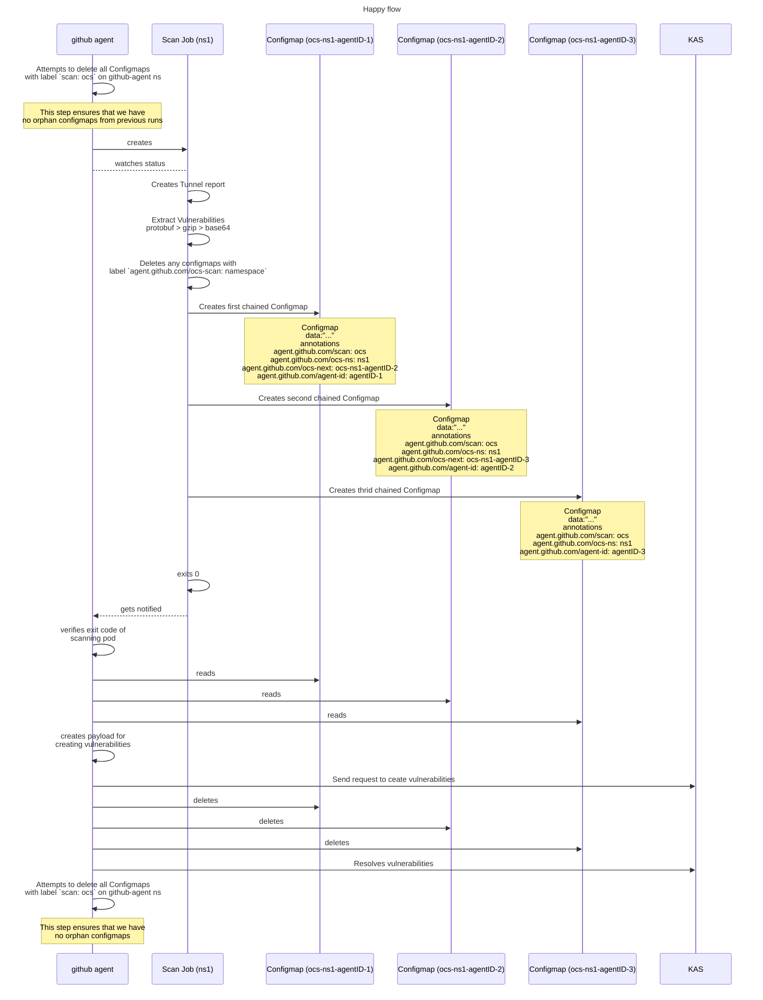

# Tunnel-K8S-Wrapper

## Purpose

The Github Agent (GA) supports Operational Container Scanning (OCS).
OCS enables the scanning of images in a Kubernetes (K8s) cluster in order to identify possible vulnerabilities.
The GA deploys a scanning pod for every namespace that needs to be scanned.
The scanning pod is using the `tunnel-k8s-wrapper` image to perform a `tunnel k8s` scan, process the data and stores them in chained configmaps.
Once the scanning process is finished the GA reads the chained configmaps and reconstructs the report.
It is the GA responsibility to delete the chained configmaps created by the tunnel-k8s-wrapper (scanning pod).

The `tunnel-k8s-wrapper` image is a wrapper around the Tunnel image.
We need to update `tunnel-k8s-wrapper` every time we have a new version of the Tunnel image.
You can do that by following the [upstream scanner upgrade guide](docs/update_scanner.md).


## System Design

In the following sequence diagram you can see all the interactions between the Scanning Pod and the Github Agent.



## How to debug locally

You can debug using VSCode studio. You can use the following configuration:

<details><summary>launch.json</summary>

```json
{
    "version": "0.2.0",
    "configurations": [
        {
            "name": "scan",
            "type": "go",
            "request": "launch",
            "mode": "auto",
            "program": "cmd/tunnel/main.go",
            "env": {

            },
            "args": [
                "scan",
                "--github-agent-ns=github-agent",
                 "--workloads=Pod,replicaset,replicationcontroller,statefulset,daemonset,cronjob,job,deployment",
                "--namespace=default",
                "--github-agent-id=1234",
            ]
        },
    ]
}
```

</details>

## Exit codes

- `0`: Successful run
- `3`: Failed to initialize a kube client
- `4`: Flags validation failed
- `5`: Failed to get the Tunnel scanner version
- `6`: Failed to execute a Tunnel scan
- `7`: Tunnel report size limit
- `8`: Failed to read Tunnel report from file
- `9`: Failed to unmarshal Tunnel report
- `10`: Failed to prepare data
- `11`: Failed to create chained [configmaps](https://kubernetes.io/docs/concepts/configuration/configmap/)

## Tunnel report size limit

We currently support a Tunnel report size limit of `100MB`.

## Nightly build/release

Nightly build/release refers to daily scheduled pipelines that build the latest version of this project and release it.
These pipelines ensure that the latest `tunnel-k8s-wrapper` image has all the latest updates.

### How to test nightly build pipelines

We advise to test nightly build pipelines by forking the project to make sure that no images are overwritten by mistake.
Triggering the nightly build pipeline can be done in the following way:

- Commit your changes directly on `main` and push
- Create a scheduled pipeline for `main` as reference and trigger it

## How to test OCS flow manually

### Prerequisites

Testing OCS requires a Kubernetes cluster.
We assume that you already have one.
If not you can deploy a K8S cluster in your GCP Sandbox environment.
You can follow the official GKE [instructions](https://cloud.google.com/kubernetes-engine/docs/deploy-app-cluster).
We currently support `arm64` and `amd64` for OCS.

We also assume that you are using VScode with Go related plugins installed.

### Step by step guide

1. First you need to create a test project. Use your github account to create a blank project.
2. Next step is to [create a github-agent configuration](https://docs.github.com/ee/user/clusters/agent/install/#create-an-agent-configuration-file). Once you have created the configuration file you can use the following sample. The `cadence` field is the cronjob based on which OCS is triggered in the github-agent.  More information about OCS configurations can be found in the [documentation](https://docs.github.com/ee/user/clusters/agent/vulnerabilities.html#enable-via-agent-configuration).

```yaml
container_scanning:
  cadence: '35 * * * *'
  vulnerability_report:
    namespaces:
      - test
  resource_requirements:
    requests:
      cpu: '200m'
      memory: 300Mi
    limits:
      cpu: '800m'
      memory: 3000Mi
```

3. Now that we have a valid github-agent configuration we need to connect our K8S cluster with the test project. Connecting the K8S cluster to a project can be found in the official [documentation](https://docs.github.com/ee/user/clusters/agent/install/). Essentially you need to go to `Operate > Kubernetes clusters` . Then click `Connect a cluster (agent)`. On the next prompt the drop down menu will have the different configurations that can be found in the `.github/agents/` directory of your test project. Select the name of the agent configuration that you created in the previous step and click `register`. Finally you will be presented with the the following:

```bash
helm repo add github https://charts.github.io
helm repo update
helm upgrade --install <AGENT_NAME> github/github-agent \
    --namespace <GITHUB_AGENT_NAMESPACE> \
    --create-namespace \
    --set image.tag=<GITHUB_AGENT_VERSION> \
    --set config.token=<TOKEN> \
    --set config.kasAddress=wss://kas.github.com
```

You can change the values of `<AGENT_NAME>`, `<GITHUB_AGENT_NAMESPACE>` and `<GITHUB_AGENT_VERSION>` as you like. We suggest to use the specified agent version though since it is the latest. The `<TOKEN>` value should be stored safely in a file so that we can use it later on.

4. Copy the above snippet to the clipboard. Open a terminal, make sure you are in the right kubectl context. You can do this using `kubectx` either `kubectl config get-context`. Then paste the above commands to the terminal and wait until the helm chart is installed.

At this point we can test OCS in two different ways.

### Normal mode testing

At this point we have the configured github-agent installed as a helm chart in the K8S cluster and connected to your test project. You can view the github-agent logs by using:

```
k logs -l app.kubernetes.io/instance=github-agent -n <GITHUB_AGENT_NAMESPACE>
```

or using [K9S](https://k9scli.io/). At this point you can trigger OCS by changing the `cadence` value in the agent config of your test project. Use a cronjob expression so that OCS is triggered in the next minute(s), commit and push your changes on master. You will see in the github-agent logs an event regarding the change in the agent's configuration. The event will look like this:

```json
{"level":"debug","time":"2024-06-27T12:56:54.126+0200","msg":"Applying configuration","commit_id":"2ea248660ed7cee6dd72788c8748482ec24a10c6","agent_config":"{"observability":{"logging":{"level":"debug"}},"agentId":"1103537","projectId":"51144296","containerScanning":{"vulnerability_report":{"namespaces":["test"]},"cadence":"57 * * * *","resource_requirements":{"limits":{"cpu":"800m","memory":"3000Mi"},"requests":{"cpu":"200m","memory":"300Mi"}}},"projectPath":"nilieskou/k8s-cluster-management","githubExternalUrl":"github.com"}","agent_id":1103537}
```

When is the time for the cronjob to execute you can see in the github-agent logs the OCS related log statements.

### Testing in Debug mode

In order to run the github-agent in debug mode you will need to make sure that the github-agent is not currently running in your cluster but at the same time the resources created by the github-agent helm chart are still present. For example we need to keep the service accounts and `ClusterRoles`, `Roles` , `ClusterRoleBinding` etc. To achieve that we will not unistall the helm chart but just delete the github-agent deployment created by the helm chart.

1. Execute
```bash
kubectl delete deployment <GITHUB_DEPLOYMENT_NAME> -n <GITHUB_AGENT_NAMESPACE>
```
2. Git clone the [github-agent](https://github.com/github-org/cluster-integration/github-agent/-/tree/master) repo.
3. Create a `.vscode/launch.json` file and paste the following configuration

```json
{
    "version": "0.2.0",
    "configurations": [
        {
            "name": "github-agent",
            "type": "go",
            "request": "launch",
            "mode": "auto",
            "program": "${workspaceFolder}/cmd/agentk/main.go",
            "cwd": "${workspaceFolder}",
            "args": [
                "--kas-address=wss://kas.github.com",
                "--token-file=<PATH_TO_THE_TOKEN_FILE>"
            ],
            "env": {
                "POD_NAMESPACE": "<GITHUB_AGENT_NAMESPACE>",
                "POD_NAME": "<GITHUB_AGENT_NAME>",
                "OCS_SERVICE_ACCOUNT_NAME": "<OCS_SERVICE_ACCOUNT>",
                "OCS_ENABLED": "true",
            }
        },
    ]
}
```

Notice that
- `<GITHUB_AGENT_NAMESPACE>`: is the namespace that we have installed the github-agent through the helm chart
- `<GITHUB_AGENT_NAME>`: the name of the github agent.
- `<OCS_SERVICE_ACCOUNT_NAME>`: This is the name of the OCS pod service account. In other words the service account that will be binded to the pod that will run the tunnel-k8s-wrapper. You can find that by running:

```bash
k get serviceaccounts -n <GITHUB_AGENT_NAMESPACE> | grep "ocs"
```

4. You can place your breakpoints and start a debug session.
5. Trigger OCS by changing the `cadence` in the github-agent config.


